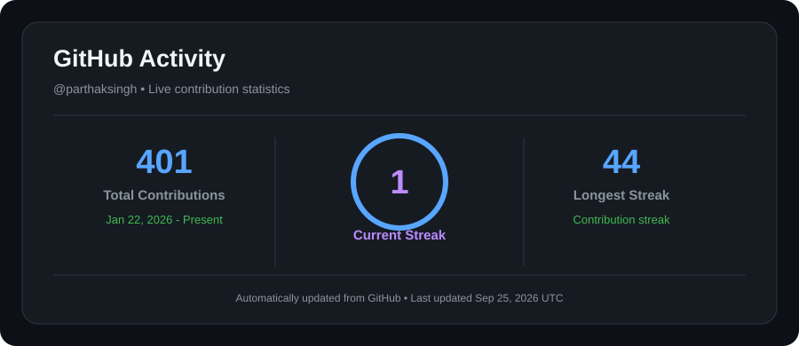

# Hi, I'm Parthak Kumar Singh 👋

Computer Science undergraduate building full-stack web applications,
AI-powered tools, and practical software while strengthening problem-solving
through Data Structures & Algorithms.

 

  

---

## 🚀 About Me

- 🎓 B.Tech in Computer Science & Engineering at Lovely Professional University
- 💻 Full-stack developer working with the **MERN stack**
- 🔌 Building **REST APIs** and data-driven web applications
- 🤖 Exploring **AI/ML and Retrieval-Augmented Generation (RAG)**
- 🧩 Practicing **Data Structures & Algorithms in C++**
- 🏆 Solved **100+ DSA problems on LeetCode**
- ☁️ Learning **Cloud & DevOps**
- 🐳 Working with **Docker**
- 🧠 Strengthening problem-solving and system design fundamentals

> 🎯 **Goal:** Build useful software, solve challenging problems, and continuously learn new technologies.

---

# 🛠️ Tech Stack

### 💻 Languages

### 🌐 Full-Stack Development

### 🗄️ Database & Cloud

### 🔧 Tools

 

`DSA` · `OOP` · `DBMS` · `Operating Systems` · `Computer Networks` · `REST APIs` · `AI/ML` · `RAG`

---

# ⭐ Featured Projects

### 💻 Code Lab

**Online Code Execution Platform**

A web-based platform that allows users to write, compile, and execute code through a browser.

**Features**

- 🧑‍💻 Online code editor
- ⚡ Code execution
- 🔐 Isolated execution
- 🐳 Docker environment
- 🌐 Browser workflow

**Tech:** `JavaScript` · `Node.js` · `Docker`

🔗 [View Repository](https://github.com/parthaksingh/Code-Lab-online-code-execution-platform)

---

### 🎓 NextOffer

**PlaceSmart**

Campus placement management system for students and administrators.

**Features**

- 👨‍🎓 Student management
- 🔐 JWT & bcrypt authentication
- 📊 Role-based dashboards
- ✅ Eligibility checks
- 🏢 Company management
- 📋 Interview tracking

**Tech:** `React` · `Node.js` · `Express` · `MongoDB` · `JWT`

---

### 🤖 RAG System Studio

A Retrieval-Augmented Generation system for document-based question answering.

**Features**

- 📄 PDF upload
- 🧩 Document chunking
- 🔍 Semantic retrieval
- 📚 Source citations
- 🤖 RAG question answering
- 🧪 RAG simulator
- 🛡️ Anti-hallucination

**Tech:** `Python` · `RAG` · `Semantic Search` · `AI`

🔗 [View Repository](https://github.com/parthaksingh/RAG-system-studio)

---

### 🤖 ContextIQ

Full-stack RAG application focused on semantic search and reliable document-based answers.

**Features**

- 🔍 Browser-side semantic search
- 🧠 all-MiniLM-L6-v2 embeddings
- 📚 Source and page citations
- 🛡️ Anti-hallucination safeguards

**Tech:** `RAG` · `Hugging Face` · `Semantic Search`

---

### 📊 Placement Management System

Web-based application for managing placement information.

**Features**

- 👨‍🎓 Student management
- 🏢 Company information
- 📋 Placement tracking
- 📊 Organized placement data
- 🌐 Web-based management interface

**Tech:** `JavaScript` · `HTML` · `CSS`

🔗 [View Repository](https://github.com/parthaksingh/placement-management-system)

---

# 📊 GitHub Stats

---

# 🧩 Problem Solving

I regularly practice Data Structures & Algorithms using C++ and focus on improving my problem-solving skills.

### Topics I Practice

---

# 💻 Coding Profiles

---

# 🏆 Achievements

| Achievement | Details |
| :--- | :--- |
| 🧩 DSA | Solved **100+ problems** on LeetCode |
| 🏆 Hackathon | **Semifinalist, 6th place** in a university hackathon |

---

# 📜 Certifications

- 🤖 **AI & ML Real-World Problem Solving using Python**  
  NumPy · Pandas · scikit-learn · **2025**

- 🌐 **Packet Switching Networks and Algorithms**  
  University of Colorado · **2024**

- 🖥️ **Introduction to Hardware and Operating Systems**  
  IBM · **2024**

- 📡 **The Bits and Bytes of Computer Networking**  
  Google · **2024**

---

# 🎓 Education

### Lovely Professional University

**B.Tech, Computer Science & Engineering**

📍 Phagwara, Punjab  
📅 **2023 – Present**

---

# 📚 Currently Learning

`Advanced DSA` · `Full Stack Development` · `AI & RAG` · `Semantic Search` · `Cloud & DevOps` · `System Design`

---

# 💬 Let's Connect

  

⭐ **Thanks for visiting my profile!**

